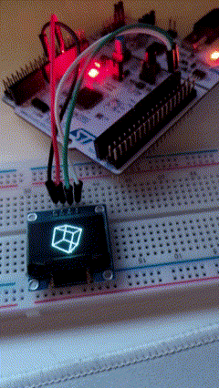

# STM32 Spinning Cube with Containerized Build Environment



This project demonstrates a simple STM32 spinning cube example with a containerized cross-compilation build environment. This approach simplifies setup and ensures consistency across different development machines.

Project is based on [STM32L152RE Nucleo board](https://www.st.com/en/evaluation-tools/nucleo-l152re.html).

Pinout from mbed [STM32L152RE MBED](https://os.mbed.com/platforms/ST-Nucleo-L152RE/).

## Features

- STM32L152RE microcontroller target
- Containerized build environment using Docker
- gcc-arm-none-eabi toolchain for cross-compilation
- ccache for faster compilations with caching
- Make as the build tool (future plans for CMake-Ninja or Meson)
- CMSIS and HAL libraries included for easy start

## Prerequisites

- Docker
- Git
- PowerShell
- ST-LINK Utility (for flashing)

## Usage

1. Clone the repository:
   ```
   git clone https://github.com/yourusername/stm32-blinky-docker.git
   cd stm32-blinky-docker
   ```

2. Initialize and update the submodules:
   ```
   git submodule init
   git submodule update --init --recursive
   ```
   This will clone the CMSIS and STM32CubeL1 libraries into the `lib/` directory.

3. Build the project:
   ```powershell
   .\build.ps1
   ```
   This script will create the Docker image if it doesn't exist and then build the project inside a Docker container.

4. Flash the program to your STM32 board:
   ```powershell
   .\flash.ps1
   ```
   Ensure your STM32 board is connected via ST-LINK before running this script.

5. To build and flash in one step:
   ```powershell
   .\build_and_flash.ps1
   ```
   This script will build the project and then flash it to your STM32 board.

## Project Structure

- `src/`: Source files
- `include/`: Header files
- `lib/`: CMSIS and HAL libraries as submodule
- `Dockerfile`: Defines the build environment
- `Makefile`: Build configuration
- `build.ps1`: PowerShell script for building the project
- `flash.ps1`: PowerShell script for flashing the program
- `build_and_flash.ps1`: PowerShell script that combines building and flashing

## TODO

- Implement FreeRTOS variant
- Consider migrating to CMake-Ninja or Meson for more advanced build configurations

## Contributing

Contributions are welcome! Please feel free to submit a Pull Request.

## License

This project is open source and available under the [MIT License](LICENSE).
